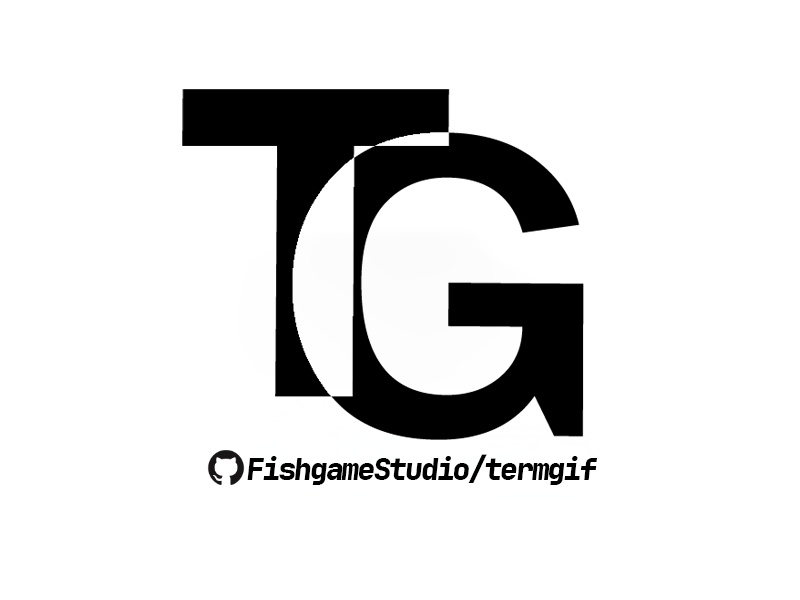
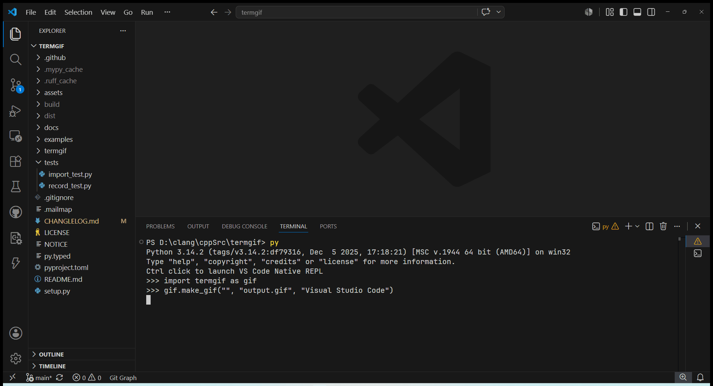

<!-- Improved compatibility of back to top link: See: https://github.com/othneildrew/Best-README-Template/pull/73 -->
<a id="readme-top"></a>
<!--
*** Thanks for checking out the Best-README-Template. If you have a suggestion
*** that would make this better, please fork the repo and create a pull request
*** or simply open an issue with the tag "enhancement".
*** Don't forget to give the project a star!
*** Thanks again! Now go create something AMAZING! :D
-->


<!-- PROJECT LOGO -->
<br />
<div align="center">
  <a href="https://github.com/FishgameStudio/termgif">
    
  </a>

# termgif
<!-- PROJECT SHIELDS -->
<!--
*** I'm using markdown "reference style" links for readability.
*** Reference links are enclosed in brackets [ ] instead of parentheses ( ).
*** See the bottom of this document for the declaration of the reference variables
*** for contributors-url, forks-url, etc. This is an optional, concise syntax you may use.
*** https://www.markdownguide.org/basic-syntax/#reference-style-links
-->


[](https://github.com/FishgameStudio/termgif/commits/main)
[](https://pypi.com/project/term2gif)


[](LICENSE)

  <p align="center">
    A simple and lightweight static GIF generator!
    <br />
    <a href="https://github.com/FishgameStudio/termgif/tree/main/docs"><strong>Explore the docs »</strong></a>
    <br />
    <br />
    <a href="https://github.com/FishgameStudio/termgif/tree/main/examples">View Demo</a>
    &middot;
    <a href="https://github.com/FishgameStudio/termgif/issues/new?labels=bug">Report Bug</a>
    &middot;
    <a href="https://github.com/FishgameStudio/termgif/issues/new?labels=enhancement">Request Feature</a>
  </p>
</div>


<!-- TABLE OF CONTENTS -->
<details>
  <summary>📖 Table of Contents</summary>
  <ol>
    <li>
      <a href="#about-the-project">🔹 About The Project</a>
      <ul>
        <li><a href="#built-with">🔹 Built With</a></li>
      </ul>
    </li>
    <li>
      <a href="#getting-started">🔹 Getting Started</a>
      <ul>
        <li><a href="#prerequisites">🔹 Prerequisites</a></li>
        <li><a href="#installation">🔹 Installation</a></li>
      </ul>
    </li>
    <li><a href="#usage">🔹 Usage</a></li>
    <li><a href="#roadmap">🔹 Roadmap</a></li>
    <li><a href="#contributing">🔹 Contributing</a></li>
    <li><a href="#license">🔹 License</a></li>
    <li><a href="#contact">🔹 Contact</a></li>
    <li><a href="#acknowledgments">🔹 Acknowledgments</a></li>
  </ol>
</details>


<!-- ABOUT THE PROJECT -->
## 🎬 About The Project


> ***"Creating clean, visually appealing demo screenshots for command-line tutorials can often be a tedious hassle—working with asciinema and ffmpeg involves a convoluted workflow. In reality, however, simply feeding it an API will resolve all such issues."***

**termgif** is a cross-platform lightweight terminal GIF recorder for Windows, macOS and Linux. It captures live terminal command execution via pixel recording and exports directly to an animated GIF.

The goal is simple: create clean, shareable command-line demo GIFs with minimal dependencies.

**Main flow**:

1. 🎥 **Record**: Launch target terminal commands, capture live screen frames (platform-aware window/region capture)
2. 🔄 **Stream**: Continuously collect pixel frames while the command runs
3. 🧩 **Generate**: Encode frames and export a final animated GIF on Ctrl+C

<p align="right"><a href="#readme-top">🔝back to top</a></p>

### 📸 Screenshot


### 🛠️ Built With

* [](https://python.org)
* [](https://docs.astral.sh/ruff)
* [](https://black.readthedocs.io)
* [](https://mypy.readthedocs.io)


<p align="right"><a href="#readme-top">🔝back to top</a></p>


<!-- GETTING STARTED -->
## 🚀 Getting Started

This is an example of how you may give instructions on setting up your project locally.
To get a local copy up and running follow these simple example steps.

### ✅ Prerequisites

This is an example of how to list things you need to use the software and how to install them.
* Hatch \(if exists\)
  ```sh
  # print all dependencies
  hatch dep show
  # print dependencies on group dep
  hatch dep show dev
  ```
_See [pyproject.toml](pyproject.toml#L28) for complete content._

### 📦 Installation

Install with PIP:
```sh
# Don't use termgif, it's registered; use term2gif instead.
pip install term2gif
```

<p align="right"><a href="#readme-top">🔝back to top</a></p>


<!-- USAGE EXAMPLES -->
## 💡 Usage

```python
import os
import subprocess as sp

import termgif

GIF_PATH: str = f"{os.path.dirname(__file__)}/dist.gif"
termgif.make_gif(
    'cmd /c "echo hello world!"', GIF_PATH # Specify the command to execute.
)
_ = sp.run([GIF_PATH], shell=True)  # Open it with the default program.

```

_For more examples, please refer to the [Documentation](docs) or [Examples](examples)_

<p align="right"><a href="#readme-top">🔝back to top</a></p>


<!-- ROADMAP -->
## 🗺️ Roadmap
- [x] **v0.1.0**: Basic recording for Windows
- [x] **v0.2.0**:
    - [x] Support for macOS and Linux
    - [x] Support for recording live inputting text on console (`stdin`)
    - [x] Support recording live console (with echo and color)

See the [open issues](https://github.com/FishgameStudio/termgif/issues) for a full list of proposed features (and known issues).

<p align="right"><a href="#readme-top">🔝back to top</a></p>


<!-- CONTRIBUTING -->
## 🤝 Contributing

Contributions are what make the open source community such an amazing place to learn, inspire, and create. Any contributions you make are **greatly appreciated**.

If you have a suggestion that would make this better, please fork the repo and create a pull request. You can also simply open an issue with the tag "enhancement".
Don't forget to give the project a star! Thanks again!

1. Fork the Project
2. Create your Feature Branch (`git checkout -b feature/AmazingFeature`)
3. Commit your Changes (`git commit -m 'Add some AmazingFeature'`)
4. Push to the Branch (`git push origin feature/AmazingFeature`)
5. Open a Pull Request

<p align="right"><a href="#readme-top">🔝back to top</a></p>

### 🌟 Top contributors:

<a href="https://github.com/FishgameStudio/termgif/graphs/contributors">
  
</a>


<!-- LICENSE -->
## 📃 License

Distributed under the project_license. See `LICENSE` for more information.

<p align="right"><a href="#readme-top">🔝back to top</a></p>


<!-- CONTACT -->
## 📬 Contact

Nicola Grey - [popxh@outlook.com](mailto:popxh@outlook.com)

Project Link: [https://github.com/FishgameStudio/termgif](https://github.com/FishgameStudio/termgif)

<p align="right"><a href="#readme-top">🔝back to top</a></p>


<!-- ACKNOWLEDGMENTS -->
## 🙏 Acknowledgments

* [Best-README-Template](https://github.com/othneildrew/Best-README-Template)
* [Pillow](https://github.com/python-pillow/Pillow)
* [PythonMSS](https://github.com/BoboTiG/python-mss)
* [PyGetWindow](https://github.com/asweigart/pygetwindow)

<p align="right"><a href="#readme-top">🔝back to top</a></p>
